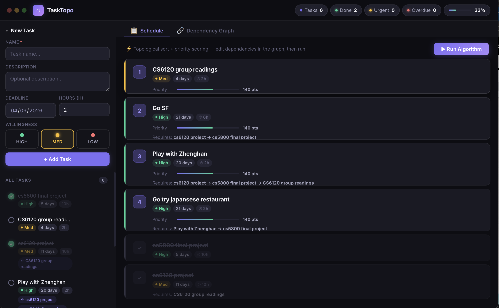
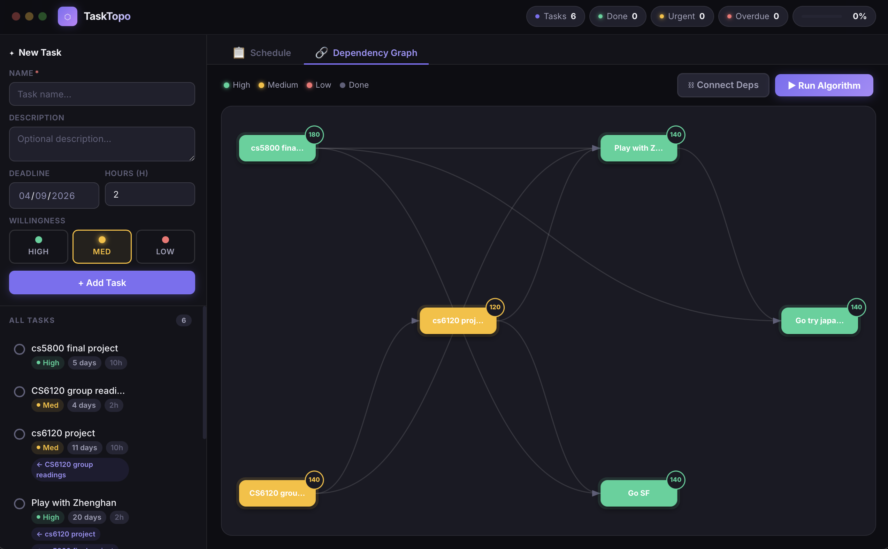
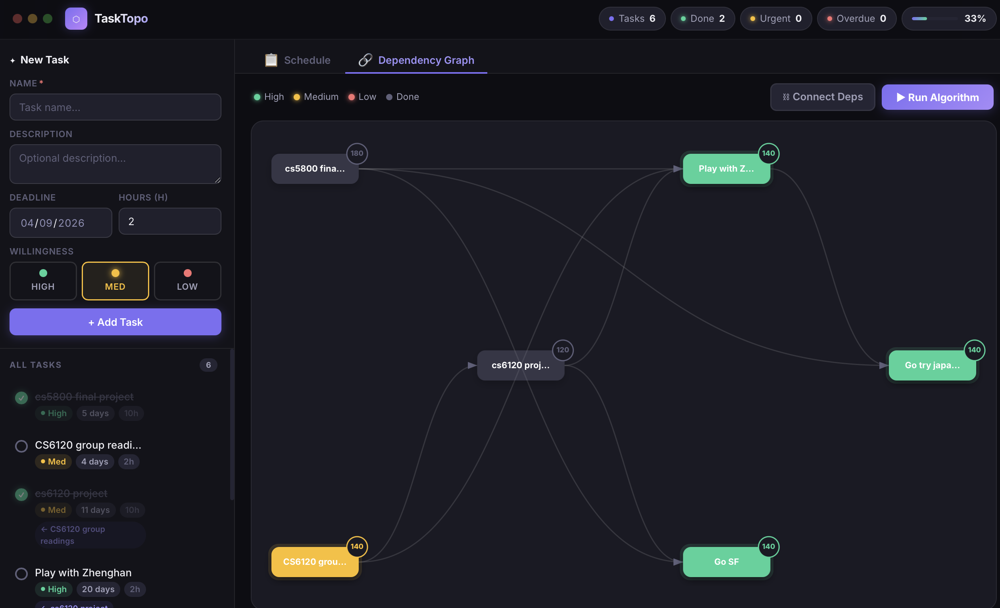

# TaskTopo — Smart Task Scheduler

> Automatically computes the optimal task execution order using **Kahn's topological sort** + **priority scoring**.
> Built with [Tauri 2](https://v2.tauri.app) — runs natively on macOS, Windows, and Linux.

---

## Screenshots

### Schedule View


### Dependency Graph



---

## How to Use

### 1 — Add a Task
Fill in the sidebar form and click **+ Add Task**:

| Field | Description |
|---|---|
| **Name** | Short task label |
| **Description** | Optional notes |
| **Deadline** | Date the task must be done by |
| **Hours** | Estimated effort in hours |
| **Willingness** | How much you want to do it — High / Med / Low |

### 2 — Set Dependencies
Switch to the **Dependency Graph** tab and click **⛓ Connect Deps**:

1. Click the task that must **wait** (e.g. *Submit Project*)
2. Click the task it **depends on** (e.g. *Algorithm HW*)
3. An arrow appears connecting the two nodes
4. Click an existing arrow's source again to **remove** the dependency
5. Press **Esc** or click **Exit** to leave connect mode

You can also click the **⛓** icon on any task in the sidebar to manage prerequisites via a checkbox list.

### 3 — Run the Algorithm
Click **▶ Run Algorithm** on either tab. The **Schedule** tab updates with the optimal execution order, respecting all dependencies.

### 4 — Mark Tasks Complete
Click the circle next to any task. Completed tasks move to the bottom of the schedule and the progress bar updates.

---

## How It Works

### Priority Score

Before scheduling, every task receives a numeric score:

```
Priority Score = willingness × 40 + urgency

willingness : High = 3,  Med = 2,  Low = 1
urgency     : overdue → 120  |  today → 100  |  ≤ 3d → 80
              ≤ 7d → 60      |  ≤ 14d → 40   |  ≤ 30d → 20  |  else → 5
```

**Example:** a High-willingness task due tomorrow scores `3 × 40 + 100 = 220`.
A Low-willingness task due in 2 weeks scores `1 × 40 + 40 = 80`.

### Kahn's Topological Sort (modified with priority queue)

Standard Kahn's processes nodes in arbitrary order. TaskTopo always picks the **highest-priority ready task** at each step:

```
1. Compute in-degree for every pending task
   (number of unfinished prerequisites)

2. Seed the queue with all tasks whose in-degree = 0

3. While the queue is not empty:
     a. Sort queue by Priority Score (descending)
     b. Pop the top task → append to schedule
     c. For each task that depended on it:
           decrement in-degree
           if in-degree = 0 → add to queue

4. Append completed tasks at the end
```

This guarantees:
- **Dependency order is always respected** — no task appears before its prerequisites
- **Among ready tasks**, the most urgent and most desired one runs first

### Cycle Detection

Before any dependency is saved, a **DFS reachability check** runs to prevent cycles:

```javascript
function wouldCycle(taskId, depId) {
  const seen = new Set();
  function dfs(current) {
    if (current === taskId) return true;  // path loops back → cycle
    if (seen.has(current))  return false;
    seen.add(current);
    return task(current).dependencies.some(dfs);
  }
  return dfs(depId);
}
```

**Why it works:** if `taskId` is reachable by following edges from `depId`, adding the edge `depId → taskId` would close a loop. The DFS visits each node at most once via the `seen` set, giving **O(V + E)** time complexity. If a cycle is detected the connection is rejected immediately.

---

## Tech Stack

| Layer | Technology |
|---|---|
| App shell | Tauri 2 (Rust) |
| Frontend | Vanilla HTML + CSS + JavaScript |
| Graph visualization | Hand-rolled SVG |
| Storage | `localStorage` — fully offline, no server |
| CI / Build | GitHub Actions |

---

## Development

**Prerequisites:** [Rust](https://rustup.rs) · [Node.js v18+](https://nodejs.org) · [Tauri system deps](https://v2.tauri.app/start/prerequisites/)

```bash
npm install   # install Tauri CLI
npm run dev   # launch dev window with hot reload
npm run build # produce release binaries
```

## Download

Pre-built binaries are generated automatically on every push to `main`.

Go to the [**Actions tab**](../../actions) → latest run → **Artifacts**:

| Artifact | Platform |
|---|---|
| `TaskTopo-macOS-Universal` | macOS (Apple Silicon + Intel) |
| `TaskTopo-Windows` | Windows 10 / 11 (x64) |
| `TaskTopo-Linux` | Ubuntu/Debian — `.AppImage` + `.deb` |
